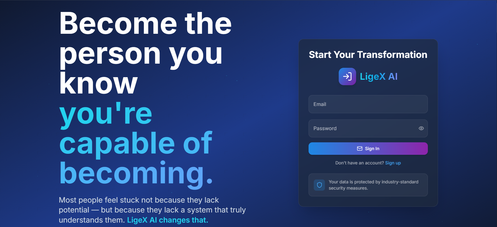

# LigeX-AI

**LigeX-AI** is currently under active private development.

This public repository is a showcase page only.

## About the Project
LigeX-AI is an AI-native Life OS focused on:
- personal growth
- mental health
- adaptive learning
- career intelligence

## Development Status
LigeX-AI has been under active development for more than a year.

A significant portion of the work was done privately before the project was uploaded to GitHub. As a result, the public GitHub activity does not represent the full product development timeline.

## Demo

## Public Materials
- [Project Overview PDF](info_LigeX_AI.pdf)

## Repository Purpose
This repository presents the project publicly without exposing the private source code.

## What is Public Here
- product overview
- selected public materials
- demo access
- project updates

## What is Private
- source code
- backend implementation
- core architecture
- proprietary logic
- environment configuration

## Status
Private development in progress.

## Contact
For demo, partnership, or investor inquiries:  
**ligexai@gmail.com**
